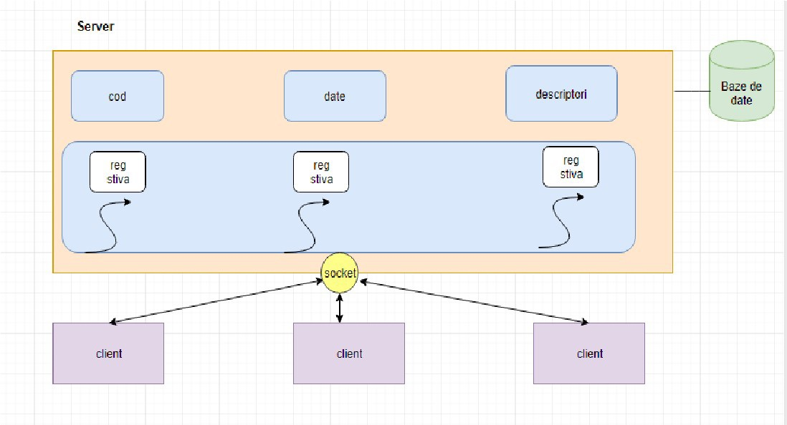
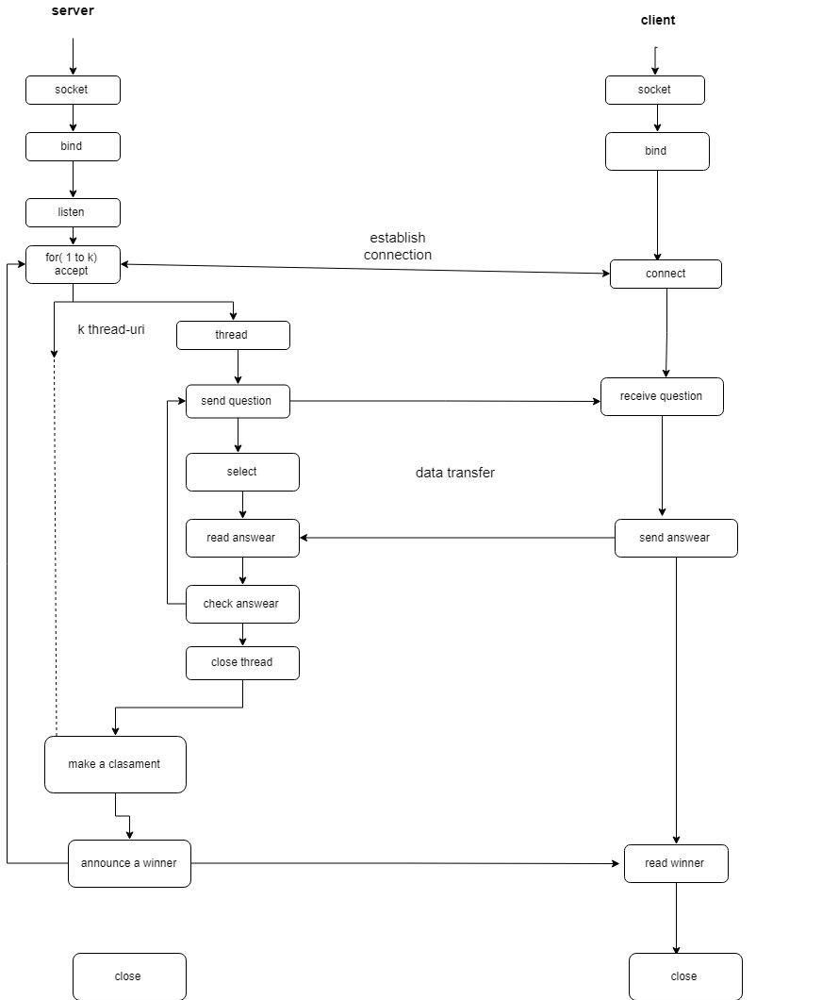

<h1>QuizzGame </h1>
<b>
Bianca Chirica 
December 2018 
</b>
 
Limbaj : C  
 
<b>1 Introduction </b>  

Proiectul QuizzGame reprezinta un server multithreading care suporta clientii
care raspund la un set de intrebari pe rand, in ordinea in care s-au inregistrat.
Fiecarui client i se pune o intrebare si are un numar n de secunde pentru a
raspunde la intrebare. Serverul verica raspunsul dat de client si daca este
corect va retine punctajul pentru acel client. La final, serverul afiseaza clientul
cu punctajul cel mai mare. 
  

  
<b>2 Tehnologii utilizate</b> 

Serverul va implementa protocolul TCP deoarece ofera siguranta si asigura
transmiterea in ordine a datelor. Informatia transmisa intre server si client este
important sa ajunga completa, altfel, informatia lipsa poate rezulta in descal-
ificarea unui jucator. Pentru crearea bazei de date care va stoca intrebarile
impreuna cu raspunsurile voi folosi SQLite3.
  
  
  
<b>3 Arhitectura aplicatiei</b>
 

 
<b>
4 Detalii de implementare  
</b>
<ul>
<li> Serverul va comunica cu clientii prin intermediul unui socket. </li>
<li> Dupa acceptarea clientilor server-ul va forma cate un thread pentru fiecare
  client cu functia pthread create. </li>
<li> In interiorul thread-ului voi folosi functia select pentru a astepta raspunsul
clientului timp de n secunde specificat ca parametrul functiei, iar daca
  respectivul client nu va respunde la timp, acesta va fi descalificat </li>
<li> Pentru determinarea castigatorului se va apela o functie int max(punctaj)
care va alege punctajul maxim.
  </li>
  </ul>
  
<b>Caz 1: (ideal)</b>

 Se initializeaza structurile de date din server. Se stabileste
conexiunea cu un fiecare client venit. Pentru fiecare client se creaza un thread,
prin intermediul caruia fiecare client primeste intrebarile cu variantele de raspuns.
Dupa fiecare intrebare, raspunsul clientului daca este primit in mai putin de n
secunde, este verificat si i se stocheaza punctajul.Daca mai vine un jucator
acesta se va conecta si va incepe jocul lui. Dupa ce jucatori au raspuns la 10
intrebari, acesti vor astepta sa termine toti clientii apoi se va alege un casti-
gator,iar punctajele se vor reseta pentru a astepta alti clienti. Thread-urile se
inchid si serverul continua sa astepte o noua runde de jucatori, in functia accept. 
Jucatorii pot, de aemenea, sa introduca intrebari in baza de date, acesti nu vor
participa la joc.  

   
  <b>Caz 2: </b>
  
In sitauatia in care un client nu raspunde la intrebarea primita in cele
n secunde, acesta va fi descalificat astefel : thread-ul lui va fi inchis, punctajul
va deveni 0, iar ceilalti jucatori vor continua fara ca jocul sa fie afectat.
  

   
<b>5 Conclusion </b>
 

In concluzie, serverul poate accepta oricat de multi clienti care vor cuncura intre
ei, apoi dupa ce toti termina intrebarile fiecare primeste numele castigatorului,
iar punctajele se reseteaza pentru a astepta alti jucatori.
O imbunatarire implementata este optiunea clientului de a alege un anumit adversar cu care sa concureze in functie de username.

<b>6 Bibliografie </b>
<ul>
  <li>profs.info.uaic.ro/ computernetworks </li>
  <li> www.draw.io </li>
  <li> www.sqlite.org/index.html </li>
  </ul>

